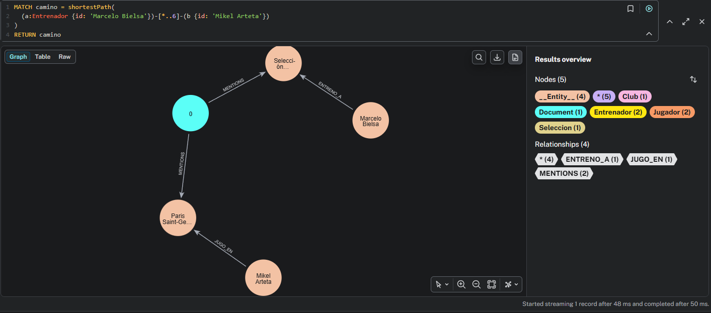
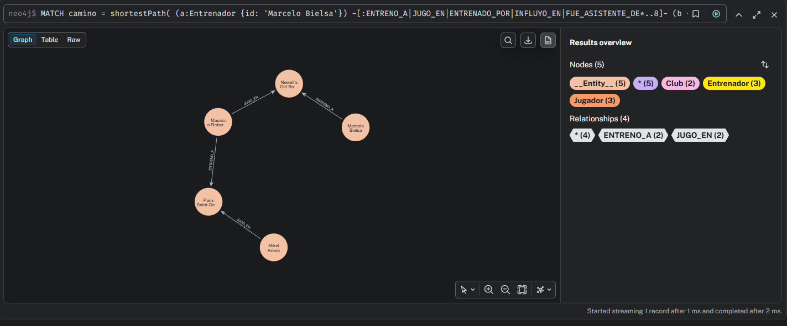

# GraphRAG sobre linajes de entrenadores de fútbol

Sistema de **GraphRAG** que construye un grafo de conocimiento a partir de
biografías de entrenadores de fútbol y responde preguntas que requieren
recorrer varias relaciones encadenadas.

Todo corre **en local**: sin claves de API, sin coste por token.

---

## La pregunta que justifica el proyecto

> ¿Qué conecta a Marcelo Bielsa con Mikel Arteta?

No existe ningún documento del corpus donde ambos aparezcan juntos. Una
búsqueda vectorial clásica (RAG) no encuentra nada: no hay ningún párrafo
que responda a esa pregunta, así que devuelve fragmentos irrelevantes o
admite que no lo sabe.

El grafo la responde recorriendo relaciones extraídas de **tres artículos
distintos**:

```
Marcelo Bielsa  ──ENTRENO_A──▶  Newell's Old Boys  ◀──JUGO_EN──  Pochettino
                                                                      │
                                                                 ENTRENO_A
                                                                      ▼
Mikel Arteta    ──JUGO_EN──▶    Paris Saint-Germain  ◀────────────────┘
```

La respuesta no está escrita en ninguna parte. Está **repartida** entre
varios documentos, y sólo emerge al conectarlos.

---

## Arquitectura

```
Wikipedia (es)  ──▶  chunks  ──▶  LLM (extracción)  ──▶  Neo4j
                                        │
                                  esquema cerrado
                                        │
                                        ▼
                            resolución de entidades
                            (automática + revisión humana)
```

| Componente | Elección | Motivo |
|---|---|---|
| Base de grafos | Neo4j 5.26 Community + APOC | Índice vectorial nativo desde 5.11: grafo y embeddings en la misma BD, sin store externo |
| LLM extracción | `qwen2.5:7b-instruct` (Ollama) | Buen seguimiento de instrucciones en español; cabe en 8 GB de VRAM |
| Embeddings | `bge-m3` (1024 dims) | Multilingüe, imprescindible para corpus en español |
| Orquestación | LangChain (`LLMGraphTransformer`) | Extracción guiada por esquema |
| Infraestructura | Docker Compose | Neo4j reproducible; Ollama nativo en el host para acceso directo a GPU |
| Python | 3.12 | 3.14 aún no tiene soporte fiable en todo el stack de LangChain |

---

## El esquema del grafo

El esquema es **cerrado**: el modelo sólo puede usar estos tipos. Sin esta
restricción, un LLM inventa un tipo distinto para el mismo concepto
(`Entrenador`, `Técnico`, `Manager`, `DirectorTécnico`) y el grafo queda
inservible porque nada conecta con nada.

**Nodos:** `Entrenador`, `Jugador`, `Club`, `Seleccion`, `Competicion`,
`EstiloJuego`

**Relaciones:**

```
(Entrenador) ─ENTRENO_A────────▶ (Club | Seleccion)
(Entrenador) ─INFLUYO_EN───────▶ (Entrenador)
(Entrenador) ─FUE_ASISTENTE_DE─▶ (Entrenador)
(Entrenador) ─PRACTICA─────────▶ (EstiloJuego)
(Jugador)    ─JUGO_EN──────────▶ (Club)
(Jugador)    ─ENTRENADO_POR────▶ (Entrenador)
(Club | Entrenador) ─GANO──────▶ (Competicion)
```

Restringir también los extremos de cada relación evita disparates como
`(Competicion)-[ENTRENO_A]->(Jugador)`.

---

## Puesta en marcha

**Requisitos:** Docker, Python 3.12, [Ollama](https://ollama.com), GPU con
8 GB de VRAM (o paciencia).

```bash
# Modelos (~6 GB de descarga)
ollama pull qwen2.5:7b-instruct
ollama pull bge-m3

# Entorno
cp .env.example .env
python -m venv .venv && source .venv/bin/activate   # Windows: .venv\Scripts\activate
pip install -r requirements.txt

# Base de datos
docker compose up -d

# Verificación: NO seguir si algo sale en rojo
python scripts/smoke_test.py
```

El `smoke_test.py` comprueba, de lo barato a lo caro: conexión Bolt, versión
de Neo4j, APOC, disponibilidad de los modelos, dimensión de los embeddings y
—lo crítico— que el LLM sepa devolver salida estructurada. Si eso último
falla, el pipeline entero es inviable, y es mejor saberlo en 30 segundos que
en el paso 3.

---

## Pipeline

```bash
python scripts/download_corpus.py          # 14 artículos de Wikipedia (es)
python scripts/ingest.py --reset           # ~5 min con GPU
python scripts/resolver_entidades2.py --limpiar              # previsualiza ruido
python scripts/resolver_entidades2.py --limpiar --confirmar  # borra
python scripts/resolver_entidades2.py --proponer             # candidatos a fusión
python scripts/aprobar.py                                    # aplica decisiones revisadas
python scripts/resolver_entidades2.py --aplicar              # fusiona
```

La deduplicación es **iterativa**: cada fusión puede destapar duplicados que
antes quedaban ocultos. Repetir `--proponer` / `--aplicar` hasta que no
aparezca nada nuevo.

---

## Hallazgos técnicos

### 1. Con Ollama, el esquema no llega al modelo por tool calling

`LLMGraphTransformer` usa por defecto function calling y mete el esquema en
la definición de la herramienta. **Ollama no traslada esa restricción al
modelo**, que extrae con sus tipos genéricos en inglés:

```
Con tool calling:    [Person] Arrigo Sacchi  -[COACHED]->  [Team] AC Milan
Con ignore_tool_usage=True:
                     [Entrenador] Arrigo Sacchi  -[ENTRENO_A]->  [Club] AC Milan
```

Peor aún: `strict_mode=True` descarta después esos tipos no permitidos **en
silencio**, dejando un grafo vacío sin ningún error. El síntoma era 0
relaciones extraídas sin traza alguna.

La solución es `ignore_tool_usage=True`, que mete el esquema en el prompt.
Contrapartida: es incompatible con `node_properties`, así que se renuncia a
las propiedades de nodo.

`scripts/debug_extraccion.py` reproduce el diagnóstico comparando cuatro
configuraciones sobre el mismo fragmento.

### 2. Ninguna métrica sola resuelve la resolución de entidades

Cuatro detectores, cada uno con un punto ciego distinto:

| Detector | Caza | Punto ciego |
|---|---|---|
| Normalización | `Real Madrid CF` = `Real Madrid` | Alias en otro idioma |
| Prefijo | `Ajax` ⊂ `Ajax de Ámsterdam` | `Liga` ⊂ `Liga de Campeones` (falso) |
| Apellido | `Ancelotti` → `Carlo Ancelotti` | Apellidos compuestos (`van Gaal`) |
| Distancia de edición | `Johann`/`Johan Cruyff` | Años: `Copa América 1991` vs `1993` |

Un primer intento con **Jaro-Winkler + union-find** fracasó de forma
instructiva: la métrica premia los prefijos comunes, y el union-find encadena
transitivamente, así que un solo par falso contamina el grupo entero:

```
Real Madrid | Real Madrid CF | Real Sociedad      ← Real Sociedad no pinta nada
Marcelo Bielsa | Rafael Bielsa                    ← son hermanos
Carlo Ancelotti | Carlo Mazzone                   ← personas distintas
```

El enfoque definitivo compara **claves normalizadas por igualdad exacta** en
lugar de medir parecido, agrupa transitivamente sólo ahí, y descarta cualquier
propuesta ambigua (si `Bielsa` encaja con dos nombres completos, no se propone
nada).

Y un diccionario manual para lo que ninguna métrica puede ver:

```
PSG                    = Paris Saint-Germain
Champions League       = Liga de Campeones de la UEFA
Girondins de Bordeaux  = Girondins de Burdeos
Maguncia               = Mainz 05
Pep Guardiola          = Josep Guardiola
```

**La resolución de entidades determina qué preguntas puede responder el
sistema.** El camino Bielsa→Arteta no existía hasta fusionar `PSG` con
`Paris Saint-Germain`: Arteta llevaba todo el tiempo a un salto de distancia
y el grafo no lo sabía.

### 3. `shortestPath` encuentra caminos, no verdades

### 3. `shortestPath` encuentra caminos, no verdades

`MENTIONS` es fontanería del pipeline (`include_source=True`) y sólo significa
"estas dos entidades salieron en el mismo artículo". Como conecta cualquier
cosa con cualquier cosa, `shortestPath` la usa siempre de atajo:



Dos de las cuatro aristas son relaciones reales. Pero el nodo central es un
`Document`, así que el camino es sintácticamente válido y semánticamente
vacío.

Restringiendo explícitamente a relaciones de dominio:

```cypher
MATCH camino = shortestPath(
  (a:Entrenador {id: 'Marcelo Bielsa'})
  -[:ENTRENO_A|JUGO_EN|ENTRENADO_POR|INFLUYO_EN|FUE_ASISTENTE_DE*..8]-
  (b {id: 'Mikel Arteta'})
)
RETURN camino
```



Cuatro saltos, todos verificados manualmente.

Y aun así, **cada arista del camino debe auditarse a mano** antes de darla por
buena: un camino con una relación alucinada se ve exactamente igual de bien.

---

## Calidad de los datos

Medición manual sobre ~50 relaciones auditadas:

| Métrica | Valor |
|---|---|
| Nodos tras extracción | 375 |
| Nodos tras limpieza y deduplicación | 275 |
| Precisión estimada de relaciones | **~88%** |

Tipos de error observados:

- **Confusión de rol.** Director deportivo o ayudante extraído como
  `ENTRENO_A` (Sacchi en el Real Madrid).
- **Confusión de sujeto.** Nodos de apellido suelto (`Guardiola`) acumulan
  relaciones de fragmentos donde el sujeto real era otro, y las traspasan al
  fusionarse.
- **Entidades espurias.** Recuentos de palmarés (`6 Premier League`),
  resultados (`cuarto puesto de la liga`) y fragmentos de frase extraídos como
  nodos.

Se decidió **no** reingestar con un modelo de 14B: el salto de calidad no
compensaba multiplicar por diez el tiempo de proceso. Es preferible una
métrica honesta y documentada que un número inflado.

---

## Limitaciones conocidas

- `INFLUYO_EN` es la relación más escasa (9 instancias). Wikipedia rara vez
  afirma explícitamente una influencia, y el prompt exige afirmación literal
  para evitar deducirla de haber coincidido en un club.
- Sin propiedades de nodo (años, nacionalidad), por la incompatibilidad
  descrita en el hallazgo 1.
- Las ediciones concretas de torneos (`Premier League 2019-20`) conviven con
  el torneo genérico. Un modelo correcto separaría `Competicion` y `Edicion`
  con una relación entre ambos.
- `langchain-experimental` está en proceso de retirada. Alternativa natural:
  `neo4j-graphrag`, mantenido por Neo4j y ya presente como dependencia.

---

## Pendiente

- [ ] Índice vectorial sobre los chunks (`Neo4jVector`, 1024 dims)
- [ ] Retriever híbrido: búsqueda semántica + expansión a nodos vecinos vía Cypher
- [ ] `GraphCypherQAChain` para preguntas agregativas ("cuántos", "quién más")
- [ ] API con FastAPI
- [ ] Paso de verificación: segunda pasada del LLM validando cada relación
      contra su fragmento de origen

---

## Estructura

```
graphrag-futbol/
├── docker-compose.yml
├── requirements.txt
├── .env.example
├── data/
│   ├── corpus/           # artículos descargados
│   └── merges.json       # decisiones de fusión revisadas
└── scripts/
    ├── smoke_test.py           # verificación de infraestructura
    ├── download_corpus.py      # descarga de Wikipedia
    ├── esquema.py              # tipos de nodo y relación permitidos
    ├── ingest.py               # chunking + extracción + carga
    ├── debug_extraccion.py     # diagnóstico de la extracción
    ├── resolver_entidades2.py  # limpieza y deduplicación
    └── aprobar.py              # decisiones de fusión, en código
```

---

## Licencia

Código bajo MIT. El corpus procede de Wikipedia en español (CC BY-SA 4.0).
